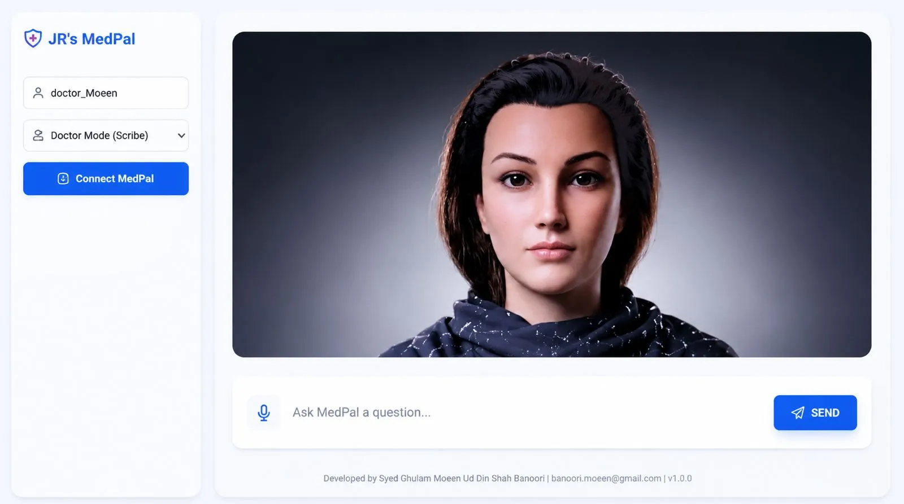
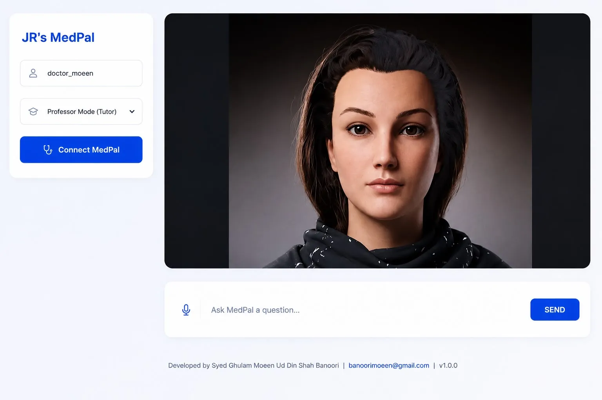
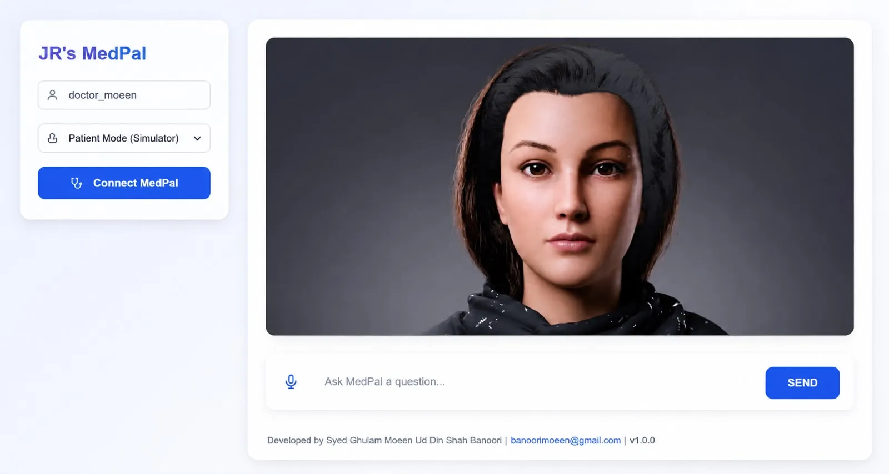

# 🩺 MedPal – AI Medical Assistant Website

<p align="center">
  
</p>

<p align="center">
  <strong>The official website for MedPal – an AI-powered medical assistant.</strong>
</p>

<p align="center">
  🌐 Live Demo: https://moeenxban.github.io/medpal-website-/
</p>

---

## 📖 Overview

This repository contains the official website for **MedPal**, an AI-powered medical assistant designed to provide reliable, handbook-based medical assistance through modern artificial intelligence technologies.

The website introduces the product, highlights its core capabilities, explains the underlying technology, and serves as the primary landing page for users, recruiters, collaborators, and healthcare professionals.

> **Note:** This repository contains only the website. The MedPal AI application and backend are maintained separately.

---

## ✨ Website Features

* Modern and responsive user interface
* Professional product landing page
* Interactive animations
* Feature showcase
* Technology overview
* Mobile-friendly design
* Fast and lightweight deployment using GitHub Pages

---

## 🧠 About MedPal

MedPal is an AI-powered medical assistant built to deliver accurate, context-aware medical information while preserving privacy through offline AI technologies.

Key capabilities include:

* 🩺 Handbook-grounded medical responses
* 🤖 Retrieval-Augmented Generation (RAG)
* 🧠 Local Large Language Models (LLMs)
* 📚 Semantic document retrieval
* 💾 Offline knowledge base
* 👨‍⚕️ Multiple AI personas (Doctor, Professor, Assistant)
* 🎙️ Voice interaction support
* 👤 Interactive AI avatar

---

## ⚙️ Technology

The MedPal ecosystem incorporates modern AI technologies, including:

* Local LLMs
* Retrieval-Augmented Generation (RAG)
* Vector Database
* Semantic Search
* FastAPI
* Python
* HTML
* CSS
* JavaScript

---

## 🚀 Live Website

**Visit here:**

https://moeenxban.github.io/medpal-website-/

---

## 🛠️ Run Locally

Clone the repository:

```bash
git clone https://github.com/moeenxban/medpal-website-.git
```

Navigate to the project:

```bash
cd medpal-website-
```

Open `index.html` in your browser or use a local development server.

---

## 📁 Project Structure

```
medpal-website-/
│
├── css/
│   ├── input.css        # Tailwind CSS entrypoint
│   └── style.css        # Compiled & minified static CSS bundle
├── gui.webp / gui.jpeg             # Desktop app UI screenshot (Main Doctor Chat)
├── patient_mode.webp / jpeg       # Patient Simulation Mode screenshot
├── professor_mode.webp / jpeg     # Professor Tutoring Mode screenshot
├── index.html           # Main landing page markup & scripts
├── package.json         # Build dependencies & CSS compilation script
└── README.md            # Project documentation
```

---

## 📸 Preview

### 🩺 Main Desktop Interface (Doctor Mode)


### 🎓 Professor Mode (Medical Tutor)


### 👤 Patient Mode (Symptom Simulation)


---

## 🎯 Purpose

The MedPal website serves as the official online presence of the project by showcasing its vision, capabilities, technology stack, and user experience. It is intended to provide a clear introduction for potential users, recruiters, researchers, and collaborators.

---

## 👨‍💻 Author

**Moeen**

AI Engineer • Machine Learning Engineer • Researcher

* GitHub: https://github.com/moeenxban
* Portfolio: https://portfolio-site-gold-beta-66.vercel.app/

---

## ⭐ Support

If you found this project interesting, consider giving the repository a ⭐ to support its development.
